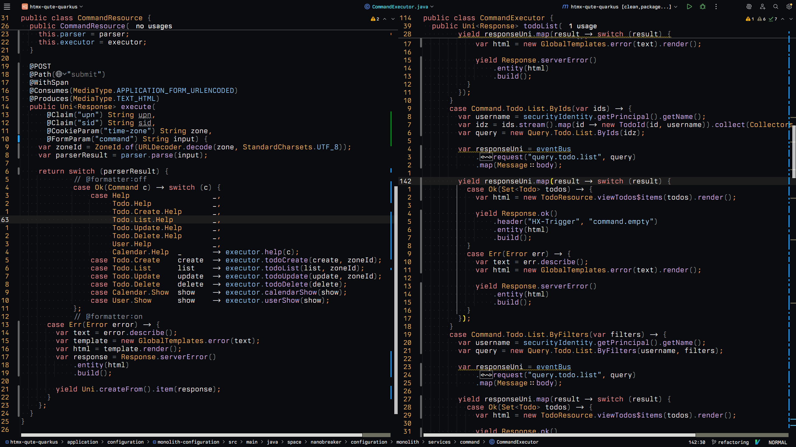

# Hellij

Guide that shows you how to configure your IntelliJ IDEA instance as you are driving Helix Editor.

## Features

### IdeaVim

Firstly, you should install IdeaVim plugin to bring in Vim engine to perform vim like
motions, https://github.com/JetBrains/ideavim, if you never tried this style I recommend to give it a try.

#### Installation

Using IDE Plugins menu simply install it by searching `IdeaVim`.

### Helix.vim

Secondly, https://github.com/chtenb/helix.vim, set of helix keybindings that override default behavior of IdeaVim plugin
and almost make it work as you are
in Helix editor.

#### Installation

Go to https://github.com/chtenb/helix.vim and copy `helix.idea.vim` into IdeaVim configuration file. You can access
configuraiton by clicking on IdeaVim icon in right bottom corner.

### Additional Configuration

Theme is limited in term what it can do with IDE, there are plenty of things that you can additionally turn off to
minimize visual noise.

- turn off gutter icons, via ui
- turn off code lens, via ui
- configure colors of IdeaVim mode widget, via ui (click on widget)

### Keymaps

Also, I have a set of custom keymaps to bring my helix keymaps with intellij much closer.

| Keymap | Description            |
|--------|------------------------|
| Ctrl+/ | Toggle comment         |
| Ctrl+, | Open IDE settings      |
| Ctrl+; | Open project structure |
| Ctrl+c | Clipboard yank         |
| Ctrl+v | Clipboard paste        |

## How to build theme

### Prerequisities

- IntellIJ IDEA
- JetBrains JDK 21+

### Build

With use of IDE itself you can build the project by selecting
`Build -> Prepare Plugin Module 'hellij' For Deployment`

### Installation

After the build you can grab the `hellij.jar` file that represents our plugin theme and install it via IDE UI
`File --> Settings --> Plugins --> Install Plugin From Disk...`

## License

This project is licensed under the MIT License. See the [LICENSE](LICENSE) file for details.